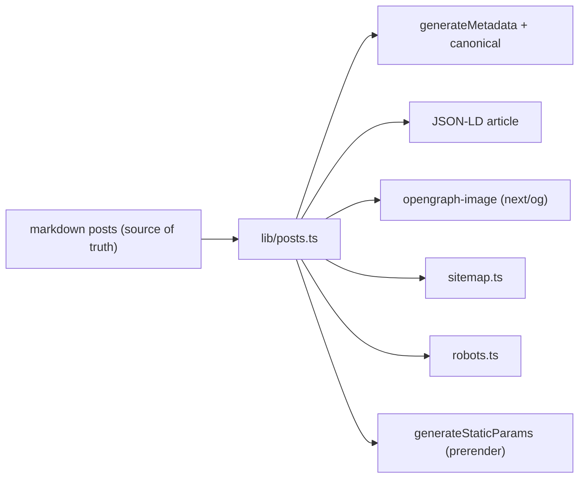
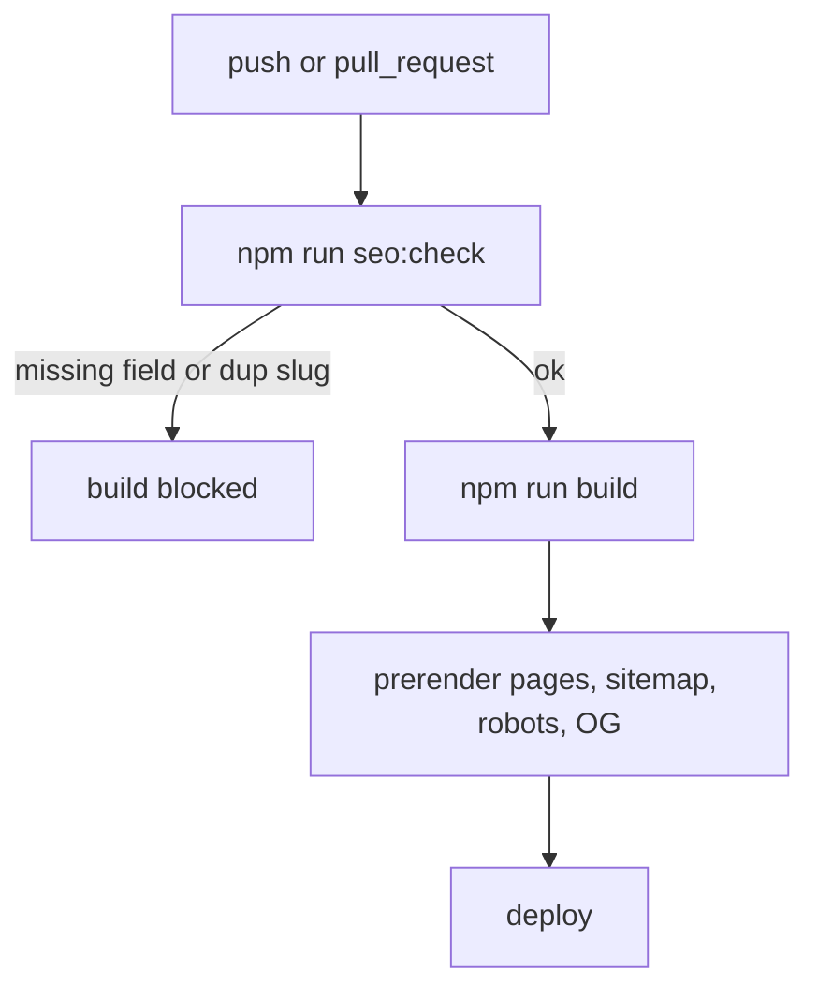

Most SEO advice for a SPA stops at "add a meta tag". That's the part that doesn't
matter. A meta tag is the last centimeter of a much longer pipeline, and every
interesting failure happens upstream of it — silently, with a green build, while
the page works fine for users and is nearly invisible to a crawler.

This post is the companion article to a repo you can run. The whole idea is one
rule: **nothing SEO-related is written twice, and nothing is maintained by hand.**
Everything is derived from a single source of truth — the markdown files — and a
CI pipeline refuses to ship if that derivation breaks.

## The shape of it



Every box on the right reads from the same `lib/posts.ts`. None of them can
disagree with the content, because none of them has its own copy of it.

## The source of truth

A post is a markdown file with frontmatter. `lib/posts.ts` reads it and — this is
the important part — **fails loud** if a post is missing a field SEO depends on,
instead of shipping a page with a blank `<title>`.

```ts
const REQUIRED_FIELDS = ["title", "description", "date"] as const;

function readPost(fileName: string): Post {
  const { data, content } = matter(raw);
  const missing = REQUIRED_FIELDS.filter((field) => !data[field]);
  if (missing.length) {
    throw new Error(`Post "${slug}" is missing required frontmatter: ${missing.join(", ")}`);
  }
  // ...normalize dates, keywords, reading time...
}
```

## The two upstream traps

**The `'use client'` boundary is a SEO decision.** `generateMetadata` only works
in a Server Component. Put `'use client'` at the top of a page to use a hook and
that route silently stops emitting metadata — no error. So the page stays a
Server Component and the only client island is a tiny leaf:

```tsx
export default async function PostPage({ params }) {
  // Server Component — generateMetadata still runs
  return (
    <article>
      <ReadingProgress />   {/* the only 'use client' island */}
      {/* server-rendered content */}
    </article>
  );
}
```

**`metadataBase` is set once.** Without it, Open Graph image URLs go out
relative — they look fine in local preview and fail the moment a link is pasted
into LinkedIn or WhatsApp, because the social scraper has no base to resolve
against. One line in the root layout fixes every absolute URL downstream.

## The sitemap that can't lie

A hand-maintained sitemap is wrong the day you forget to update it. In the App
Router `sitemap.ts` is a function, so it reads the same posts the pages do:

```ts
export default function sitemap(): MetadataRoute.Sitemap {
  return getAllPosts().map((p) => ({
    url: absoluteUrl(`/posts/${p.slug}`),
    lastModified: p.updated ?? p.date,
  }));
}
```

## The part nobody shows: the YAML

All of the above is correct only if it stays correct. That's the job of CI. The
pipeline is deliberately two steps, cheap-first:



The workflow itself, `.github/workflows/seo-check.yml`:

```yaml
name: SEO check

on:
  push:
    branches: [main]
  pull_request:

jobs:
  seo:
    runs-on: ubuntu-latest
    steps:
      - uses: actions/checkout@v5
      - uses: actions/setup-node@v5
        with:
          node-version: 22
          cache: npm
      - run: npm ci
      # Guard the source of truth first — cheap, fails fast on bad frontmatter.
      - run: npm run seo:check
      # Then prove the SEO artifacts actually build (metadata, sitemap,
      # robots, OG images are all produced during the build).
      - run: npm run build
```

Two things make this "professional" rather than decorative:

1. **`seo:check` runs before `build`.** Validating frontmatter takes
   milliseconds; a full Next build takes minutes. Ordering the cheap guard first
   means a bad post fails the PR almost instantly, with a readable message,
   instead of after a long build with a cryptic stack trace.
2. **The same check is the `prebuild` script.** It runs locally on every
   `npm run build` too — so CI and your machine enforce the identical rule, and
   "works on my machine" can't drift from "passes in CI".

Here's the guard it runs. It's plain Node, no framework — it reads the markdown
and refuses anything that would ship broken SEO:

```js
const REQUIRED = ["title", "description", "date"];

for (const file of files) {
  const { data } = matter(read(file));

  const missing = REQUIRED.filter((field) => !data[field]);
  if (missing.length) error(`${slug}: missing ${missing.join(", ")}`);

  if (seen.has(slug)) error(`${slug}: duplicate slug`);
  if (data.description?.length > 160) {
    warn(`${slug}: description may be truncated in search results`);
  }
}

process.exit(errors ? 1 : 0);   // non-zero fails the workflow
```

The `exit(1)` is the whole point. A warning is advice; a non-zero exit is a
gate. Description too long? Warning — your call. Missing a canonical-critical
field, or two posts colliding on the same slug? The build does not happen.

## Why this ages well

None of this is a trick you learn once. The App Router already rewrote how SEO
works in React, and it will move again. What survives a version bump isn't the
config — it's the shape: **one source of truth, every artifact derived, a CI gate
that fails loud.** When Next changes the API, you change one derivation and the
pipeline tells you immediately if you got it wrong.

A green build was never the same as green SEO. The crawler doesn't run your
tests — so make the build refuse to exist when the SEO is broken.
